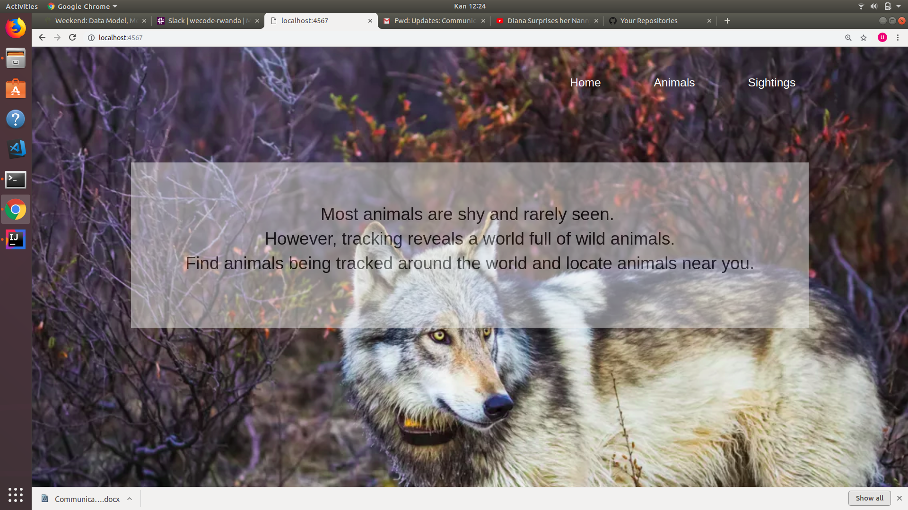
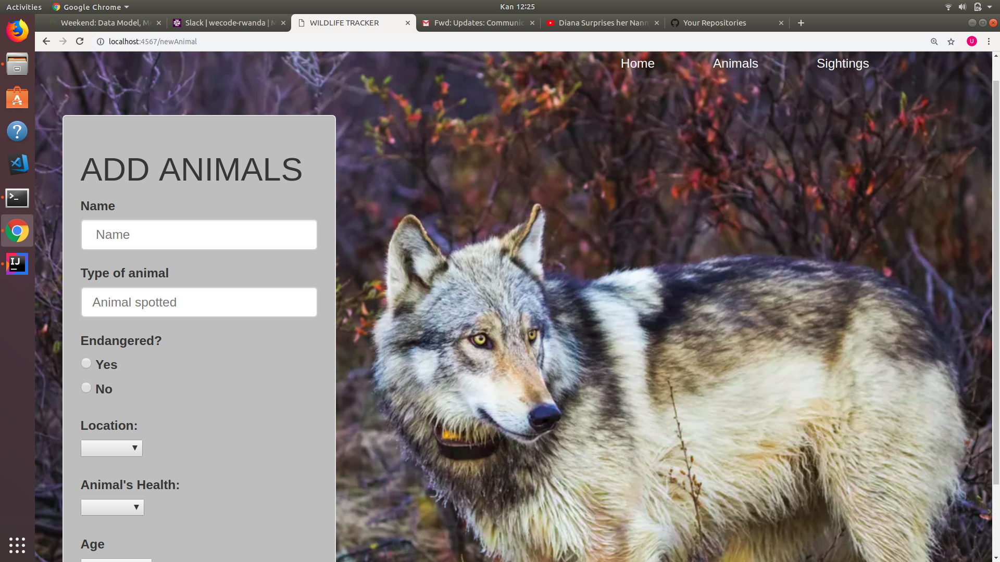
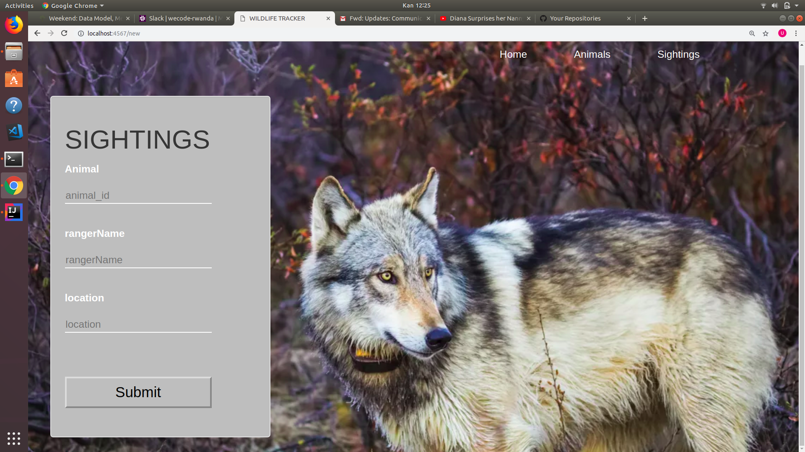
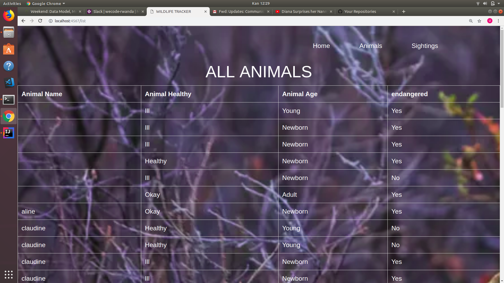

# wildlife-tracker

# wildlife-tracker

## *By Claudine UMUHIRE*

## Description

This is an app to track wildlife sightings in a particular area.
Tracks animal sightings with detail about animal, location. 
## SETUP INSTALLATION REQUIRED
    *UBUNTU
    *INTELLIJ
    
 ## TECHNOLOGY USED 
 
    *JAVA 
    *NETWORK connection

## BDD

HOMEPAGE

Animal form 

Sighting form

Database

## Support and contact details
contact us on claudinos1990@gmail.com.

### License
MIT Copyright (c) 2019 By Claudine UMUHIRE. 
# wildlife-tracker

